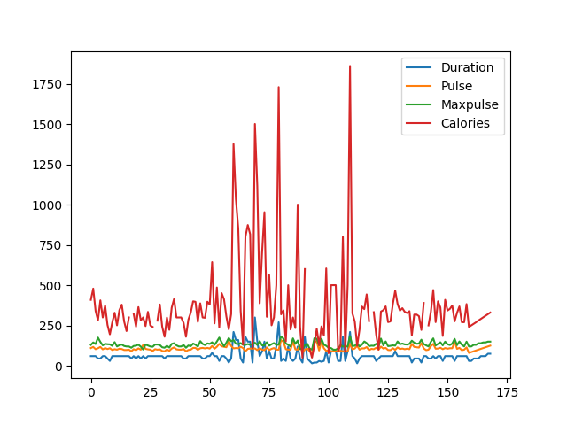

# Pandas Workbook

In order to import the Pandas module we use the following:
```python
from pandas import DataFrame, Series
```

## Introduction
```python
from pandas import DataFrame
dataset = {
    "cars": ["BMW", "Volvo", "Ford"],
    "passings": [3, 7, 2]
}

df = DataFrame(dataset)
print(df)
```
- DataFrame is a structure like a table
- The indexing of labels starts from 0
- Keys of a dataset are interpreted as headers (column names)
- Values of a dataset are interpreted as the cell values

## Series
Slicno kolonama; predstavlja 1 dimenzioni niz


```python
from pandas import Series
lista = [1, 7, 2]
series = Series(lista)
print(series)

series = Series(lista, index = ["x", "y", "z"])
print(series)
print(series["y"])
```
Moguce je ucitati i recnik kao seriju, pri cemu kljucevi postaju indeksi
```python
from pandas import Series
dataset = {
    "cars": ["BMW", "Volvo", "Ford"],
    "passings": [3, 7, 2]
}
series = Series(dataset)
print(series)
```

Odabirom natpisa za listu index mozemo da biramo vrednosti koje ce biti deo niza
```python
from pandas import Series
calories = {
    "day1": 420,
    "day2": 380,
    "day3": 390,
}
series = Series(calories, index = ["day1", "day3"])
print(series)
```

## Dataframe
Dvodimenziona struktura, tabela ili matrica

Za dohvatanje odredjenog reda ili redova mozemo da koristimo `loc[value]`. Kada se koriste `[ ]` zagrade, rezultat je uvek novi Pandas DataFrame. 
```python
from pandas import DataFrame
dataset = {
    "calories": [420, 380, 390],
    "duration": [50, 40, 45]
}
df = DataFrame(dataset)
print(df.loc[1])
print(df.loc[[0, 2]])
```

You can use `loc[string]` if you're using named indexes.
```python
from pandas import DataFrame
dataset = {
    "calories": [420, 380, 390],
    "duration": [50, 40, 45]
}
df = DataFrame(dataset, index = ["day1", "day2", "day3"])
print(df.loc["day1"])
```

## Reading CSV and JSON files
You can read a CSV file by using `read_csv("file.csv")`. The file will be read as a DataFrame. Only a preview of the data will be shown. If you want to show all the data, please use `set_option('display.max_rows', None)`. You can also use `df.to_string()` in order to print the entire DataFrame.
```python
from pandas import read_csv, set_option
set_option('display.max_rows', None)

df = read_csv("countries.csv")
print(df)
```
You can read JSON files by using `read_json("file.json")`. The file will be read as a DataFrame. Only a preview of the data will be shown. If you want to show all the data, please use `set_option('display.max_rows', None)`. You can also use `df.to_string()` or if the data is inside a Python variable with a json structure, you can read it using `DataFrame(data)`.
```python
from pandas import read_json

df = read_json("data.json")
print(df)
```

## Working with DataFrames
You can fetch the first 5 and last 5 rows using `df.head()` and `df.tail()` respectively. Additionaly, you can add a number as a parameter to select how many rows you want to take. For example: Getting the last 7 rows can be done by using `df.tail(7)`. You can get information about the data in the DataFrame with `df.info()`. The info method also shows you how many non-null values there are in each column. 
```python
from pandas import read_csv
df = read_csv("countries.csv")

print(df.head())
print(df.tail())
```

## Data Cleaning
Dana cleaning is fixing bad data in a specific data set. Types of bad data could be: 
- Empty cells
- Data in wrong format
- Wrong data
- Duplicates

### Removing Data
In Pandas we can generate a new DataFrame where the rows which contain empty cells using the method `df.dropna()`.
```python
from pandas import read_csv
df = read_csv("countries.csv")

new_df = df.dropna()
print(new_df.info())
```
If in fact we need the data to be cleaned up in the original data set, we can use the argument `inplace = True`:
```python
from pandas import read_csv
df = read_csv("countries.csv")

df.dropna(inplace = True)
print(df.info())
```
### Replacing Empty Values
We can add a new value to empty cells using `df.fillna()`. If we want to replace all the null values with a certain number, we can do the following:
```python
from pandas import read_csv
df = read_csv("countries.csv")

df.fillna(30.0, inplace = True)
print(df.info())
```
If instead we want to replace the null values in a specific column, we need to do the following:
```python
from pandas import read_csv
df = read_csv("countries.csv")

df["percent_industry"].fillna(35.0, inplace = True)
df["percent_services"].fillna(25.0, inplace = True)
print(df.info())
print(df.to_string())
```
We can fix any bad data format using `to_datetime()`. Format specifies what type of data should be read. By default it is set to `%Y/%m/%d`. Any null value will be treated as NaT (Not a Time). To clean up all the NaT values, we can just use `df.dropna()` with the argument `subset=["ColumnName"]` set for the appropriate column.
```python
import pandas as pd
df = pd.read_csv("calories.csv")

df["Date"] = pd.to_datetime(df["Date"], format = "mixed")
df.dropna(subset = ["Date"], inplace = True)
print(df.to_string())
```
If a certain value is incorrectly input, we can replace it by accessing the specific cell using `df.loc[index, "ColumnName"]`. Here we are going to try to correct any value that may contain the appropriate digits but are too large because they're wrongly inserted. 
```python
import pandas as pd
df = pd.read_csv("calories.csv")

for i in df.index:
    value = df.loc[i, "Duration"]
    if value > 120:
        if str(value).__contains__("4") and str(value).__contains__("5"):
            df.loc[i, "Duration"] = 45
        elif str(value).__contains__("6") and str(value).__contains__("0"):
            df.loc[i, "Duration"] = 60
        else:
            df.loc[i, "Duration"] = 120

print(df.to_string())
```
If we instead want to remove the rows, we can just use `df.drop(index, inplace = True)`.

We can check for duplicates using `df.duplicated()`. This will return a Series of boolean values. The value True will be applied on all the duplicated values that haven't shown up above previously (always takes the last items as duplicates). Additionally, we can remove them using `df.drop_duplicates()`. 
```python
import pandas as pd
df = pd.read_csv("calories.csv")

print(df.duplicated().head(14))
df.drop_duplicates(inplace = True)
print(df.duplicated().head(14))
```

### Mean, Median and Mode
- Mean calculates the average value in a column. Sums up all the non-null values and divides them by how many there are:
```python
from pandas import read_csv
df = read_csv("countries.csv")

mean = df["percent_industry"].mean()
print(f"{mean:.3f}")
```
- Median finds the value that is in the middle. 
```python
from pandas import read_csv
df = read_csv("countries.csv")

median = df["percent_industry"].median()
print(f"{median:.3f}")
```
- Mode finds the values that is the most frequent. The returning value is a new Series.
```python
from pandas import read_csv
df = read_csv("countries.csv")

mode = df["percent_industry"].mode()
print(mode[0])
```

## Data correlation
Using Pandas, we can establish relationships between each column in a single data set. This allows us to see whether there might be any correlation between 2 columns of data. This means that we can see whether certain data inside a column implies growth or shrinking of data inside another. Correlation can be determined by a numerical value ranging from -1 to 1.
- The correlation result of `1` means that there is a *perfect correlation* between 2 columns. Any column will have a perfect correlation with itself.
- A correlation result close to `1` (for example `0.92`) means a very *good correlation*. We can assume there is an implication of the first column to the second. If we have a large value in the first column, we can expact to see a large value in the second one as well.
- A correlation result close to `-1` (for example `-0.92`) also means a very *good correlation*, but in a different sense. If we have a larger value in the first column, we expect to see a smaller value in the second, and vice versa.
- Any correlation result near `0` means a *bad correlation*. We cannot see any implication between the two columns. If a certain data value rises, we can't determine which values we can expect in the second column.

In order to determine the correlation of data inside a DataFrame, we can use the `df.corr()` method.
```python
import pandas as pd
df = pd.read_csv("calories_fixed.csv")

print(df.corr())
```
In this example we can determine the following:
- Prediction: The longer the duration of a work out, the more calories are burnt.
- We cannot say whether a duration of a work out has little to no impact on the maximum pulse of a person.

## Plotting
In order to plot data, we need to use the `matplotlib` library.
```python
import pandas as pd
import matplotlib.pyplot as plt
df = pd.read_csv("calories_fixed.csv")

df.plot()
plt.show()
```

 In order to create a scatter plot we add the argument `kind = "scatter"`. However, we also need to assign which values are going on the x-axis and which on the y-axis.
```python
import pandas as pd
import matplotlib.pyplot as plt
df = pd.read_csv("calories_fixed.csv")

df.plot(kind = "scatter", x = "Duration", y = "Calories")
plt.show()
```
